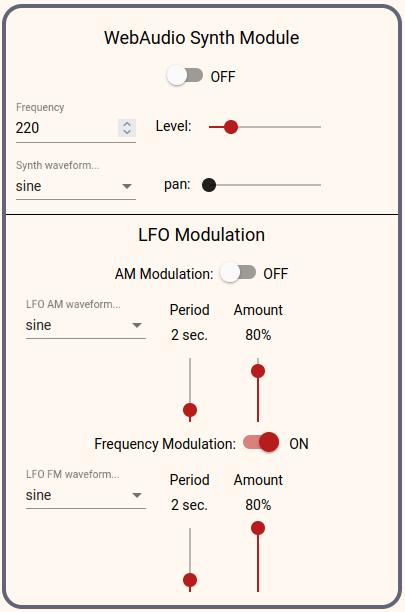
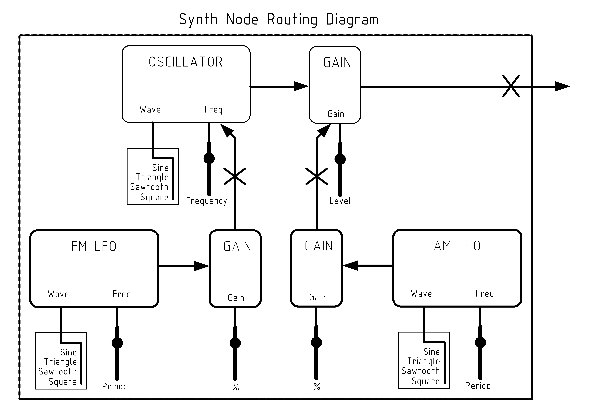

# WebAudio Stereo Synth
## A Drop-In Component Using Web Audio

## Setup

This is a drop-in stereo synth for angular/angular material. To use just copy the 'synth' folder into your app code. You also need angular material and either a pre-built theme or one of the themes from 'synth/material/themes/' or your own custom theme. The component has two inputs: [ctx]="yourAudioContext" and [dest]="yourDestination". The destination could be as simple as ctx.destination for the speakers/headphones OR a pannerNode or splitterNode for complex routing to build say a sequencer.

    // using a custom theme in styles.scss, also add fonts for ligature icons...
    @use "./app/material/themes/brick-light.scss" as theme;
    @use "./app/material/fonts/material-fonts.css";

    <!-- adding it to your app...-->
    <stereo-synth #synth1 [ctx]="myCtx1" [dest]="myDest1"></stereo-synth>

    // inside app-component.ts or some service.ts
      .
      .
      .
    export class AppComponent implements OnInit {
      myCtx1;
      myDest1;
      @ViewChild('synth1') synth1: ElementRef;
          // just in case you need to reference the DOM el...

      constructor() {}

      ngOnInit() {
        this.myCtx1 = new (window as any).AudioContext();
        this.myDest1 = this.myCtx1.destination;
            // or set to some splitter or panner for complex routing...
      }

## Concepts

The synth contains three oscillatorNodes - synthOscillator is the source generator, amLfoOscillator can periodically control the source level, fmLfoOscillator can periodically control the source frequency. The source is connected to an on/off gainNode and then connected to a gainNode and the gainNode is connected to a pannerNode and finally connected to the destination. The following diagram shows the node connections:

Each oscillator has a selection of waveshapes: sine, triangle, sawtooth, and square. The source frequency is controlled by an <input\> with a range of 20hz to 20000hz. Both modulation LFO's have a 'percent' fader controlling how much of the gain/frequency is changed and a 'period' fader to control the frequency from 5hz to 0.1hz (ten seconds). Modulations can be toggled on/off. AM modulation will change the level from amPercent to the outputLevel and can go all the way from 0 to outputLevel. FM modulation will change the output frequency both plus and minus the percent * outputFrequency.

These synths are mostly meant to provide 'atmosphere' type sounds, but they could easily be used in a sequencer as the 'tone block' with proper filtering for attack and decay. There would be one synth for each note value in the sequencer.

## A Simple Example

The example app has two synths connected to the speakers/headphones. Use good quality headphones or good studio monitors to actually hear low frequencies. My el-cheapo speakers cut out at around 90hz, My phones are Tascam TH-02 and let me hear 20hz (my AKG M-70 phones also work but I like the Tascam better). Two suggested settings for atmosphere are:

Example 1:

- synth1 frequency = 100, wave = sine, level = 0.1
- synth1 AM = off
- synth1 FM = on, wave = sawtooth or square, amount = 100%, period = 1 seconds
- synth2 frequency = 35, wave = sine, level = 0.8
- synth2 AM = off
- synth2 FM = on, wave = sine, amount = 15%, period = 5 seconds

Example 2:

- synth1 frequency = 600, wave = sine, level = 0.05
- synth1 AM = on, wave = square, amount = 100%, period = 1 seconds
- synth1 FM = off
- synth2 frequency = 200, wave = sine, level = 0.5
- synth2 AM = on, wave = sine, amount = 80%, period = 1.2 seconds
- synth2 FM = on, wave = sine, amount = 50%, period = 0.4 seconds

[Angular Synth Demo App](https://hawkrdg.com/webaudiosynth)

Play with it and have fun...! And a very good place to start learning about the WebAudio API would be:

[MDN Using Web Audio](https://developer.mozilla.org/en-US/docs/Web/API/Web_Audio_API/Using_Web_Audio_API)
