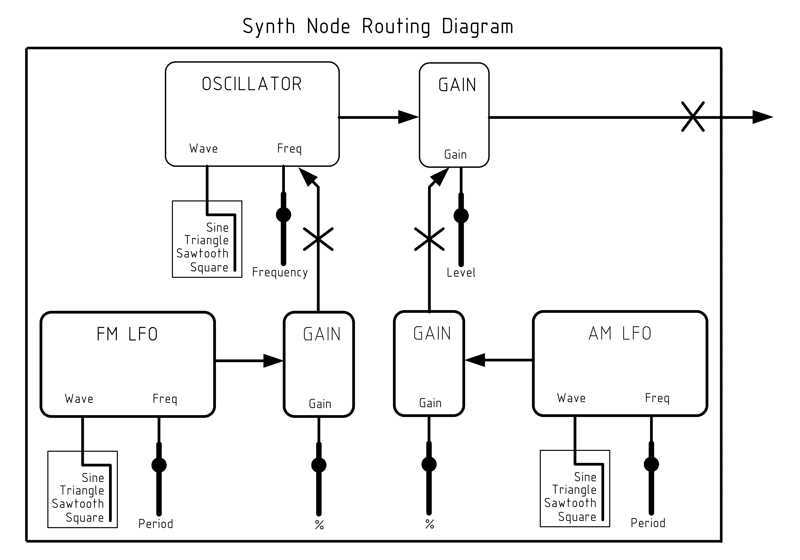
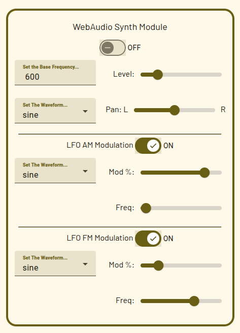

# Web Audio Stereo Synth Demo

## Concepts

The synth contains three oscillatorNodes - synthOscillator is the source generator, amLfoOscillator can periodically control the source level, fmLfoOscillator can periodically control the source frequency. The source is connected to an on/off gainNode and then connected to a gainNode and the gainNode is connected to a pannerNode and finally connected to the destination. The following diagram shows the node connections:




Each oscillator has a selection of waveshapes: sine, triangle, sawtooth, and square. The source frequency is controlled by an <input\> with a range of 20hz to 20000hz. Both modulation LFO's have a 'percent' fader controlling how much of the gain/frequency is changed and a 'period' fader to control the frequency from 10hz to 0.1hz (ten seconds). Modulations can be toggled on/off. AM modulation will change the level from amPercent to the outputLevel and can go all the way from 0 to outputLevel. FM modulation will change the output frequency both plus and minus the (percent * outputFrequency).

These synths are mostly meant to provide 'atmosphere' type sounds, but they could easily be used in a sequencer as the 'tone block' with proper filtering for attack and decay. There would be one synth for each note value in the sequencer.

## A Simple Example

The example app has two synths connected to the speakers/headphones. Use good quality headphones or good studio monitors to actually hear low frequencies. My el-cheapo speakers cut out at around 90hz, My phones are Tascam TH-02 and let me hear 20hz (my AKG M-70 phones also work but I like the Tascam better). Two suggested settings for atmosphere are:

Example 1:

- synth1 frequency = 100, wave = sine, level = 0.1
- synth1 AM = off
- synth1 FM = on, wave = sawtooth or square, amount = 100%, period = 1 seconds
- synth2 frequency = 35, wave = sine, level = 0.8
- synth2 AM = off
- synth2 FM = on, wave = sine, amount = 15%, period = 5 seconds

Example 2:

- synth1 frequency = 600, wave = sine, level = 0.05
- synth1 AM = on, wave = square, amount = 100%, period = 1 seconds
- synth1 FM = off
- synth2 frequency = 200, wave = sine, level = 0.5
- synth2 AM = on, wave = sine, amount = 80%, period = 1.2 seconds
- synth2 FM = on, wave = sine, amount = 50%, period = 0.4 seconds

[Angular Synth Demo App](https://hawkrdg.com/webaudiosynth)

Play with it and have fun...! And a very good place to start learning about the WebAudio API would be:

[MDN Using Web Audio](https://developer.mozilla.org/en-US/docs/Web/API/Web_Audio_API/Using_Web_Audio_API)

## A Drop-In Angular Component Using Web Audio & Material Design



This is an Angular / Material app. Each synth is a drop-in component that can be added to your app. To use just copy the 'synth' folder into your app code. You will need to edit the HTML if your are not using Material to remove all the 'mat-this' and 'mdc-this' references. The widget collection is just: [button, select, input (number & slider)].

The component has two inputs: an 'AudioContext' and a 'Destination'. For a component to use the synth just import it and drop it into your component HTML:

```
<!-- add it to your component HTML...->
<app-synth #synth1 [ctx]="myCtx1" [dest]="myDest1"></app-synth>

// inside component.ts
//
      .
      .
      .
export class myComponent {
  myCtx1;
  myDest1;
  // just in case you need to reference the DOM el...
  @ViewChild('synth1') synth1: ElementRef;
      .
      .
      .
  ngOnInit() {
    this.myCtx1 = new window.AudioContext();
    this.myDest1 = this.myCtx1.destination;
    // or set to some splitter or panner for complex routing...
  }
      .
      .
      .
}
```
This is a simple example and could be fleshed out to create a real synthesizer. Or the concepts here of gain | panning | routing | modulation could be used to create a software mixer or something else entirely. The Web Audio latency is quite low and performance is really good.